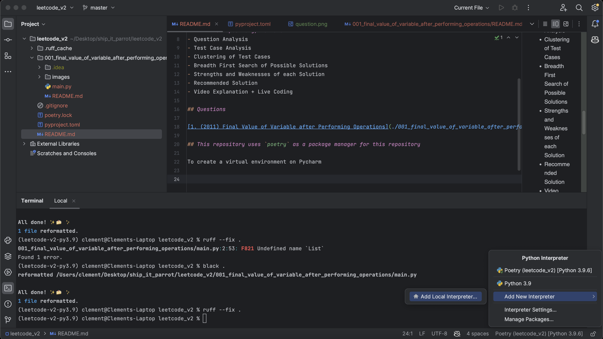
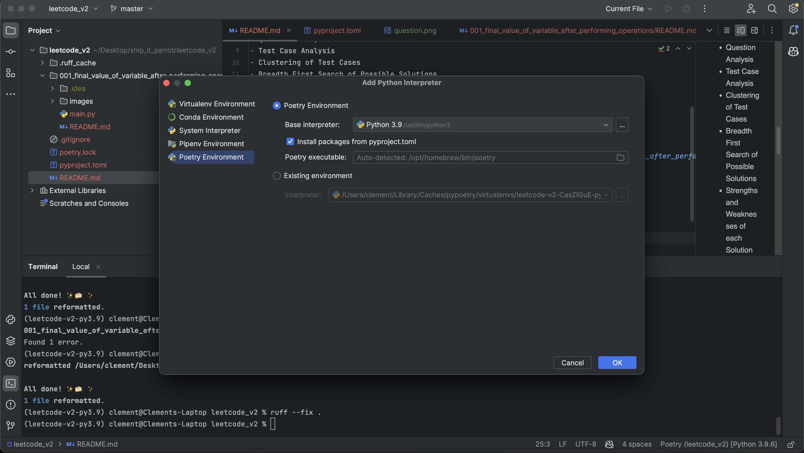
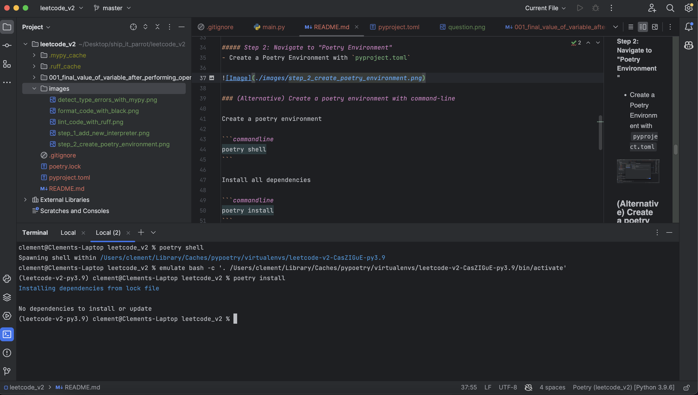
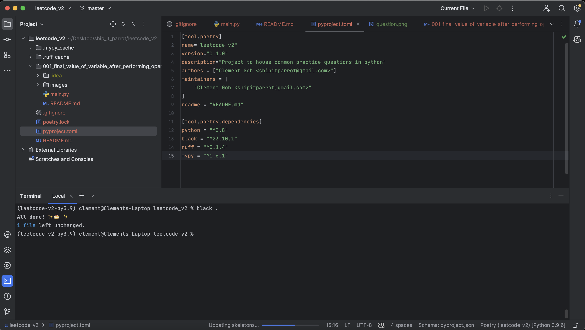
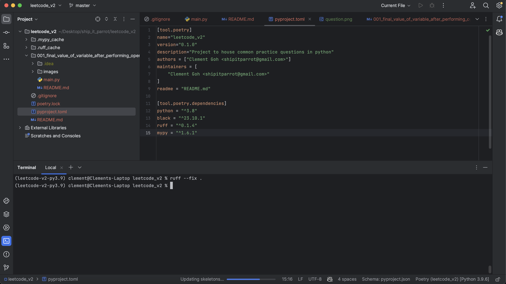
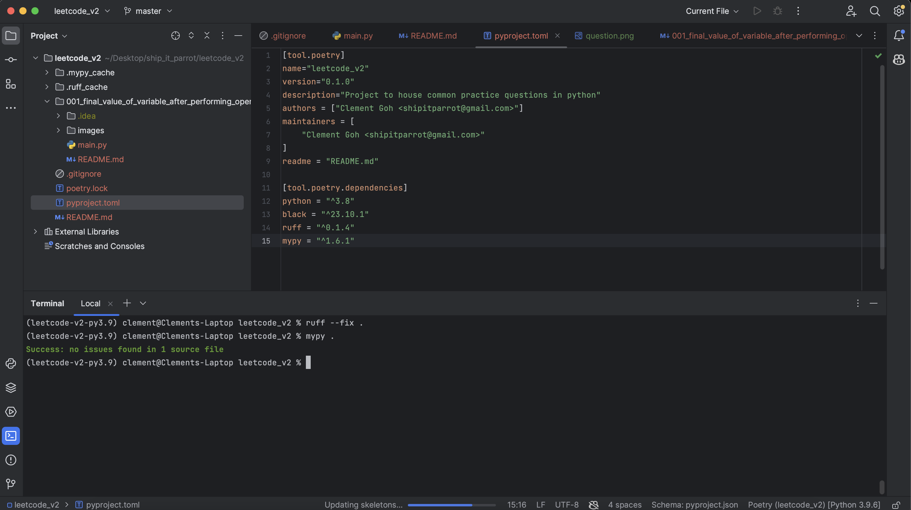
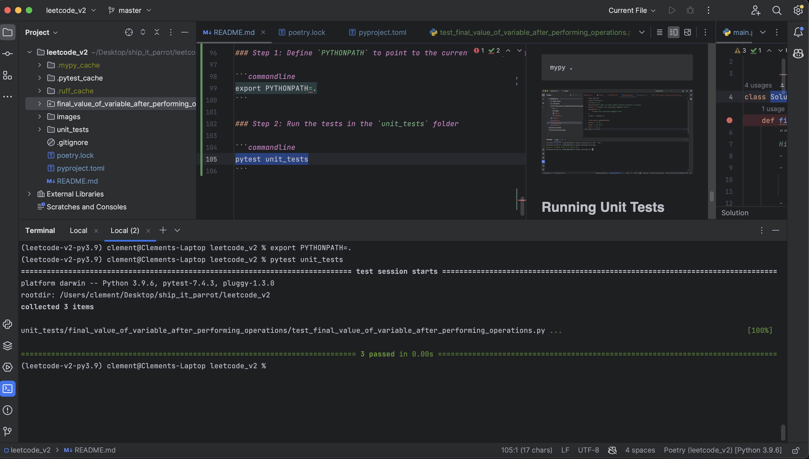

# Leetcode V2

## This repository houses recommended questions for practicing fundamentals in mastering
- Fundamentals in Python
- Data Structures and Algorithms in Python

## In this repository, we have
- Question Analysis
- Test Case Analysis
- Clustering of Test Cases
- Breadth First Search of Possible Solutions
- Strengths and Weaknesses of each Solution
- Recommended Solution
- Video Explanation + Live Coding
- Unit Tests for each proposed Solution.

## Questions

1. [(2011) Final Value of Variable after Performing Operations](questions/final_value_of_variable_after_performing_operations/README.md)
2. [(2114) Maximum Number of Words found in Sentences](questions/maximum_number_of_words_found_in_sentence/README.md)


## This repository uses `poetry` as a package manager for this repository

### (Recommended) Create a poetry environment with Pycharm

This is recommended, as doing so will bind the code editor to the poetry environment too
- This lets Pycharm detect errors better for you with it

#### To create a virtual environment on Pycharm

##### Step 1: On the bottom right corner of your code editor, look for the interpreter button.
- Add a new Interpreter



##### Step 2: Navigate to "Poetry Environment"
- Create a Poetry Environment with `pyproject.toml`



### (Alternative) Create a poetry environment with command-line

Create a poetry environment

```commandline
poetry shell
```

Install all dependencies

```commandline
poetry install
```



## Formatting code with `black`

This allows us to easily format our code neatly

To format all files in the current directory and it's children folders

```commandline
black .
```



## Linting code smells with `ruff`

This allows us to catch any errors easily in our code

To lint for code smells in the current directory and it's children folders

```commandline
ruff --fix .
```



## Detecting incorrect type hints with `mypy`

This allows us to catch trivial type errors prior to running the code

To detect type errors in our current directory and it's children folders

```commandline
mypy .
```



## Running Unit Tests

This allows us to unit test every solution

### Step 1: Define `PYTHONPATH` to point to the current working directory. This allows `pytest` to detect the unit test files properly from the `PYTHONPATH`

```commandline
export PYTHONPATH=.
```

### Step 2: Run the tests in the `unit_tests` folder

```commandline
pytest unit_tests
```

