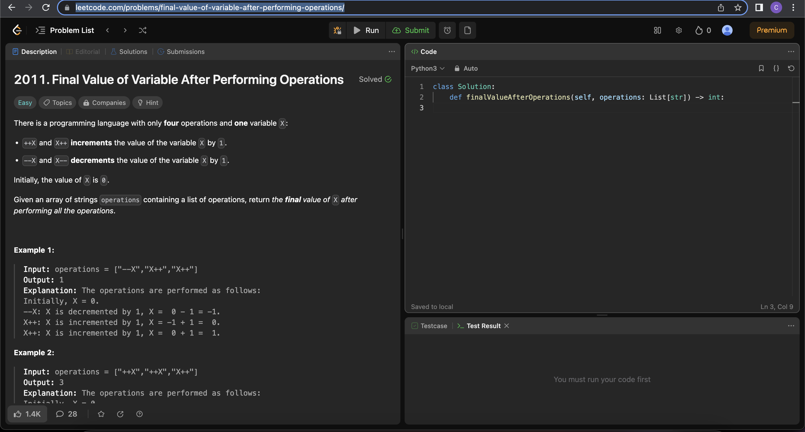
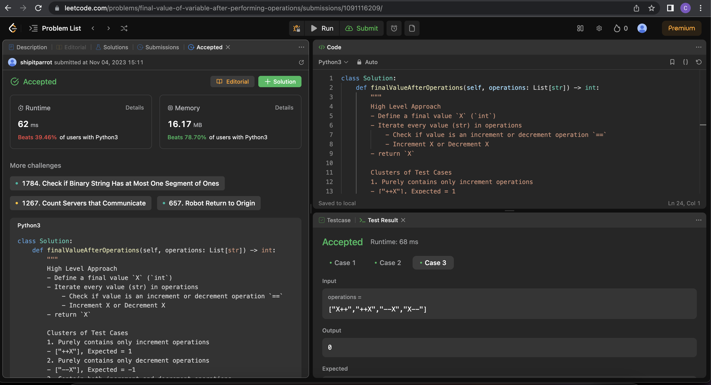

# Final Value of Variable after Performing Operations

[Link to Question](https://leetcode.com/problems/final-value-of-variable-after-performing-operations/)

## Prerequisite Concepts:

- Arrays (list in python)
  - Iterating an array with `for`
- Strings (str in python)
  - Checking if two `str` are the same with the `==` operator

## Question

## Link to Live Attempt

[ShipItParrot](https://www.youtube.com/watch?v=-5Sz8xnPGwg)

## Clusters of possible test cases

### 1. Purely contains only increment operations
- ["++X"], Expected = 1

### 2. Purely contains only decrement operations
- ["--X"], Expected = -1

### 3. Contain both increment and decrement operations
- ["--X", "++X"], Expected = 0

### 4. No operations, Expected = 0
- []

## Recommended Approaches

### Approach 1:

#### High-Level Explanation

- Define an `int` variable, representing the final value of variable
- Check all operations in the input list (`list[str]`)
  - For each operation, check if it is an incrementing or decrementing operation
  - increment or decrement the final value of variable
- Return the final value of variable

#### Implementation

[Link to Implementation](./main.py)

#### Worst-case Time Complexity

Worst Case Time Complexity:
- In the worse case scenario, how does your algorithm's time taken to run
- Scale with the input size N?
- Removing co-efficients, and only taking the highest power (polynomial)
- O(N)

#### Worst-case Space Complexity:
- in the worst case scenario, how does your algorithm's RAM (random access memory)
- Scale with input size N?
- Removing co-efficients, and only taking the highest power (polynomial)
- O(1)

## Acceptance

