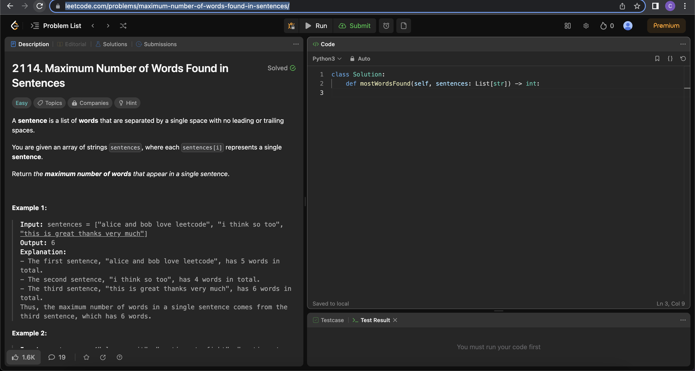
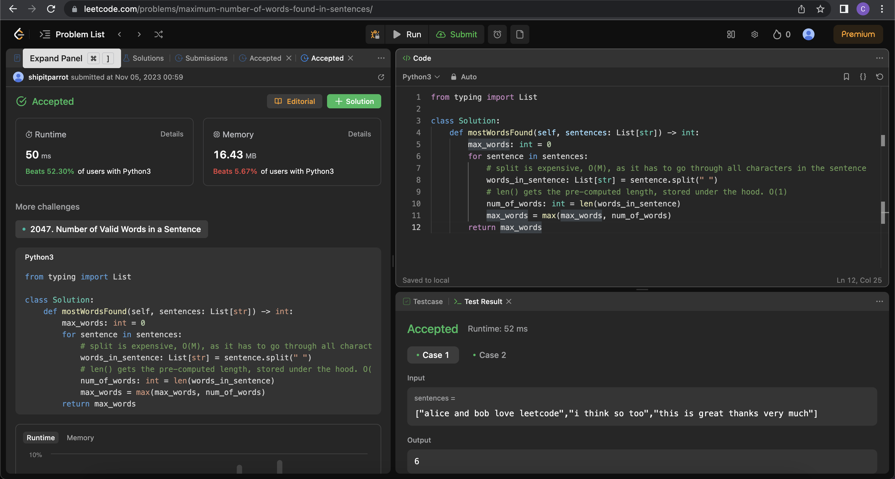

# Maximum Number of Words found in Sentence

[Link to Question](https://leetcode.com/problems/maximum-number-of-words-found-in-sentences/)

## Prerequisite Concepts:

[1. Iterating each `str` in a `List[str]` with `for`](../../prerequisite_concepts/list/001_iterating_items_in_a_list.md)

[2. python's standard `str`'s `split` method, to split a sentence into a `List[str]` by space as a delimiter `" "`](../../prerequisite_concepts/str/001_split_string_by_delimiter.md)

[3. Iterating characters in a `str` with a `for` loop](../../prerequisite_concepts/str/002_iterating_characters_in_a_string_with_a_for_loop.md)

[4. Checking if a `str` with a single character is a space](../../prerequisite_concepts/str/003_checking_if_a_string_is_equal_to_another_string.md)

[5. Checking length of a `list` with `len()`](../../prerequisite_concepts/list/002_checking_length_of_a_list_with_len.md)

[6. Getting max of two numbers with `max()`](../../prerequisite_concepts/arithmetic/001_getting_max_of_two_numbers_with_max.md)

[7. Getting max of multiple numbers](../../prerequisite_concepts/arithmetic/002_getting_max_of_multiple_numbers.md)

## Question

## Link to Live Attempt

[ShipItParrot](TBC)

## Clusters of Possible Test Cases

### 1. One sentence, containing one word

[
    "cheese"
]

### 2. One sentence, two or more words

[
    "cheese is good"
]

### 3. Two or more sentences, two or more words each, both have the same number of words

[
    "cheese is good",
    "coffee is good"
]

### 4. Two or more sentences, two or more words each, one have more words than others

[
    "cheese is good",
    "coffee is also good"
]

## Recommended Solution

### Approach 1: Words in a Sentence = Number of Spaces between Words in a Sentence + 1

- Use a variable to keep track of the maximum number of words in a sentence
- For each sentence
  - count the number of spaces between words. 
  - Number of words is equal to number of spaces + 1. 
  - Update the maximum number of words in a sentence
- Return the maximum number of words in a sentence

#### Approach 1 Implementation

[Approach 1](approach_1.py)

#### Approach 1 Worst Case Time Complexity:

Q: How does the time taken for the proposed solution to run, scale in the worst case, with 
- N as number of sentences
- M as number of characters in each sentence

A: O(NM) Worst Case Time Complexity
- We have to go through all sentences (N)
  - For each sentence, we have to go through all characters once, to look for spaces

#### Approach 1 Worse Case Space Complexity:

Q: How does the memory usage (Random Access Memory) for the proposed solution to run, scale in the worst case, with
- N as number of sentences
- M as number of characters in each sentence

A: O(M) Space Complexity
- We use `max_words` as an `int` variable
- We use `number_of_words`, `number_of_spaces_between_words` as an `int` variable (re-used for each sentence)
- We use `sentence` as a `str` variable 
  - and set it to a copy of each sentence in input `sentences: List[str]`
  - contains `M` characters

Due to the `sentence` variable
- We use O(M) space complexity

#### Approach 1 Acceptance

## Alternative Solutions

### Approach 2: Split Sentence into a `List[str]` of words with a space (`" "`) as a delimiter.

- Use a variable to keep track of the maximum number of words in a sentence
- For each sentence
  - count the number of spaces between words. 
  - Number of words is equal to number of spaces + 1. 
  - Update the maximum number of words in a sentence
- Return the maximum number of words in a sentence

#### Approach 2 Implementation (Almost the same performance as Approach 1)

[Approach 2](approach_2.py)

##### Tip:
- Theoretically, Approach 1 is slightly faster compared to Approach 2
- Both Approach 1 and Approach 2 requires only 
  - one loop through each sentence
  - one loop through each character in the sentence
- However, Approach 2 requires the creation of a `List` to store the words. Approach 1 does not.

- However, in practice, Approach 2 will be faster than Approach 1
Approach 1 does not use python' standard functions, while Approach 2 does.
- Approach 2 uses python's standard functions, such as `str`'s `split` and `len()`.
- It is way faster than our own algorithm of checking for spaces in python
  - The standard functions are implemented in the C programming language, a lower programming language. 
  - C can be faster than python as it is closer to the hardware, and can be more efficient.
- Python's standard library is compiled to machine code, and the CPython interpreter applies optimizations to make it run faster

#### Approach 2 Worst Case Time Complexity:

Q: How does the time taken for the proposed solution to run, scale in the worst case, with 
- N as number of sentences
- M as number of characters in each sentence

A: O(NM) Worst Case Time Complexity
- We have to go through all sentences (N)
  - For each sentence, we have to go through all characters once (M), to split the sentence into words
- `len()` doesn't require a full iteration of the `List[str]`, it re-uses the pre-computed length of the `List` under the hood

#### Approach 2 Worse Case Space Complexity:

Q: How does the memory usage (Random Access Memory) for the proposed solution to run, scale in the worst case, with
- N as number of sentences
- M as number of characters in each sentence

A: O(M) Space Complexity
- We use `max_words` as an `int` variable
- We use `num_of_words` as an `int` variable. This is re-used for each sentence.
- We use `words_in_sentence` as a `List[str]`, storing as many characters as there are in each sentence (O(M))
  - This is re-used for each sentence

Due to the `words_in_sentence` variable
- We use O(M) space complexity

#### Approach 2 Acceptance

